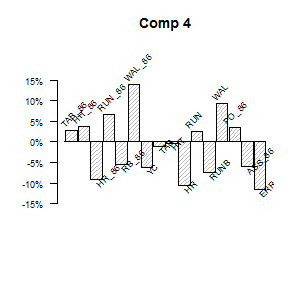
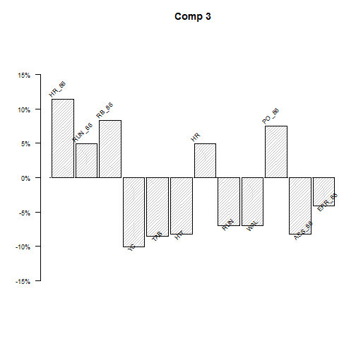
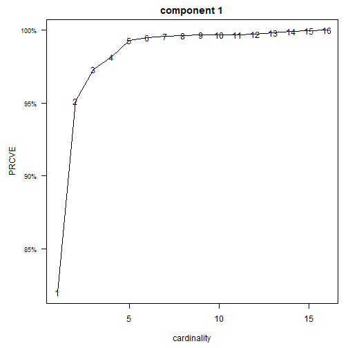

******


<!-- read_chunk('Chunks_baseball_1986_avgs.R') -->
## Example on the baseball data
 

```r
library(spca)
```


```
loaded spca version: 0.6.0.9005
```

###The data
The `bsbl_avg` contains 16 carrer and 1986 season statistics on Major League Baseball players.

```r
data(bsbl_avg)
data(bsbl_labels)
print(bsbl_labels, right = FALSE)
#>    short.name label                           
#> 1  TAB_86     times at bat in 1986            
#> 2  HIT_86     hits in 1986                    
#> 3  HR_86      home runs in 1986               
#> 4  RUN_86     runs in 1986                    
#> 5  RB_86      runs batted-in in 1986          
#> 6  WAL_86     walks in 1986                   
#> 7  YC         years in the major leagues      
#> 8  TAB        times at bat during his career  
#> 9  HIT        hits during his career          
#> 10 HR         home runs during his career     
#> 11 RUN        runs during his career          
#> 12 RUNB       runs batted-in during his career
#> 13 WAL        walks during his career         
#> 14 PO_86      put outs in 1986                
#> 15 ASS_86     assists in 1986                 
#> 16 ERR_86     errors in 1986
```

The heatmap of the correlation shows a block structure defined by offensive and defensive play in career and in season. However the offensive play statistics are also correlated  across blocks.


```r
library(ggplot2)
library(reshape2)
q = qplot(x = Var1, y = Var2, xlab = "", ylab = "", las = 2, data = melt(bsbl_avg[, 16:1]), fill = value, 
    geom = "tile") + scale_fill_gradient2(limits = c(-1, 1))
q + theme(axis.text.x = element_text(angle = 90, hjust = 1))
```

 

###  Principal Component Analysis
PCA can be computed with the `pca` function. This is a simple eigendecomposition and produces an *spca* object. It can also generate the screeplot and prrint Kaiser rule, which are useful for determining the number of components to include in the model.

```r
bc.pca = pca(bsbl_avg, scree = T, kai = T)
#> [1] "number of eigenvalues larger than 1 is 3"
# <__ names in object -->
names(bc.pca)
#> [1] "loadings" "vexp"     "cvexp"    "vexpPC"   "val"      "ind"      "kaiser"
```

 


```r
# <__ plot the first four loadings
plot(bc.pca, cols = 4, plotvex = FALSE, plotload = TRUE, variables = TRUE, rotlab = 45, size = 0.75, 
    mfrow = 1, mfcol = 1)
```

    

As expexcted, there are a few larger ones and other smaller ones. 

The plot of only the contributions larger than with absolute value > 4% is shown below.

```r
plot(bc.pca, cols = 4, thresh = 0.04, plotvex = FALSE, plotload = TRUE, variables = TRUE, rotlab = 45, 
    size = 0.75, mfrow = 1, mfcol = 1)
```

    

The first component is more or less an average without defensive play and years in career.\cr 
The others are different contrasts.

Following the literature, instead of interpreting the threshold loadings we compute the sparse ones.

###  Choosing the cardinality

In order to choose the cardinality of the sparse loadings, the traces of the elimination can be inspected using the function `choosecard`. Computing the solutions requires choosing the cardinality at each step. This is usually done interactively. We thunk that the best choice is cardinality *(3, 3, 4)*. However, for this script, we ran the selection automatically only for the first component by setting *interact = 3*.  The solution would have been computed using the BE elimination. Alternatively, the the BB algorithm could have been used. This may take a long time for larger matrices.

In the call below we require to print the traces of the trimming for the last six cardinalities the sparse contributions and their statistics. We also plot the statistics for all cardinalities, fewer could be plotted with `cardstoplot`. The *Cardinality Plots* show for each cardinality, in clockwise order: 

* Minaimal contribution (*Min contr*) versus the cardinality;
* Percentage of cumulative variance of the PCs explained (*PRCVE*) versus the cardinality;
* Percentage of cumulated variance explained (*PCVE*) versus *Min Contr*;
* Entropy vs cardinality.

For brevity we show only the first trace, but we chose cardinalities 3, 3 and 4 .We choose the first cardinality as 3 in order to avoid being greedy. Cardinality 4 for the first component could have been chosen.


```r
##<__ print and plot the trace of trimming for each component using card 3, 3 and 4 
bc.cc = choosecard(bsbl_avg, unc = FALSE, prntrace = TRUE, cardstoprint = 6, mfrow = 1, mfcol = 1, 
                   interact = c(3))
#> Trace Comp 1
#> Percent contributions
#>   Card MinLoad MinCont PVE    PRCVE  Entropy RUNB  HIT_86  WAL_86 TAB   HR_86 RUN  
#> 6 6    0.31     12.8%   53.1%  99.5% 0.30     18.5  22.8    15.1   16.2  14.6  12.8
#> 5 5    0.34     15.4%   53.0%  99.3% 0.32     17.7  22.5    16.6   27.8  15.4      
#> 4 4    0.34     17.6%   52.4%  98.2% 0.34     34.3  29.8    18.3   17.6            
#> 3 3    0.30     18.1%   51.9%  97.3% 0.34     47    34.8    18.1                   
#> 2 2    0.65     46.1%   50.8%  95.1% 0.34     53.9  46.1                           
#> 1 1    1.00    100.0%   43.7%  82.0% 0.00    100
```

    

The command below computes the BE solution as if we had chosen the cardinalities interactively.

```r
## <__ print and plot the trace of trimming for each component using card 3, 3 and 4
bc.cc = spcabe(bsbl_avg, nd = 3, unc = FALSE, mincard = c(3, 3, 4), msg = FALSE)
```

The solutions can be printed n different ways, as shown below.

### Print the sparse solutions
`choosecard` produces a proper **spca** object, in this case obtained with the BE algorithm, which is 
printed below


```r
# <__ print summaries of cc
summary(bc.cc)
#>            Comp1 Comp2 Comp3
#> PVE        51.9% 12.3% 9.3% 
#> PCVE       51.9% 64.2% 73.5%
#> PRCVE      97.3% 96.1% 95.7%
#> Card       3     3     4    
#> Ccard      3     6     10   
#> PVE/Card   17.3% 4.1%  2.3% 
#> PCVE/Ccard 17.3% 10.7% 7.4% 
#> Converged  1     1     1    
#> MinCont    18.1% 30%   13.9%
## <__ print the contributions__
bc.cc
#> Percentage Contributions
#>         Comp1 Comp2 Comp3
#> HIT_86   34.8    30    26
#> HR_86                20.1
#> WAL_86   18.1            
#> HIT                 -40.1
#> RUNB       47 -36.2      
#> ASS_86              -13.9
#> ERR_86         33.8      
#>         ----- ----- -----
#> PCVE    51.9  64.2  73.5 
#> 
```
The first table shows that the LS SPCA solutions explain about 97% of the variance explained by PCs. The smallest contribution is above 18% for all components.

From the second table it can be seen that the first component regards offensive play, about 50% season and 50% career performances. The other component are different contrasts of the different dimensions.

Since we chose to compute correlated components, the correlations among them are shown below and they are negligeable.

```r

## <__ check the correlation among the components
round(bc.cc$cor, 2)
#>      [,1] [,2] [,3]
#> [1,]    1 0.00 0.00
#> [2,]    0 1.00 0.02
#> [3,]    0 0.02 1.00
```
### Plot the sparse solutions

The results can be also inspected visually, as shown below. 


The sparse contributions can also be plotted against the contributions of the corresponding PCs, as follows.

```r
## <== Percentage contributions of the the LS SPCA(BE)(3, 4, 4) <== and Cumulative variance explained
## by LS SPCA(BE) compared with PCA
plot(bc.cc, plotload = TRUE, methodname = "BE", variablesnames = TRUE, addlabels = TRUE, rotlabels = 0, 
    size = 0.75)
```

    

```r

## ----plot cc pc, echo = TRUE, tidy = TRUE, fig.keep='all', fig.show='hold', fig.cap = 'Sparse vs PC
## contr.', fig.align='center')---- <== Percentage contributions of the the LS SPCA(BE)(3, 4, 4) <==
## and Cumulative variance explained by LS SPCA(BE) compared with PCA
plot(bc.cc, plotv = TRUE, plotloadvsPC = TRUE, pcs = bc.pca, variablesnames = TRUE, addlabels = TRUE, 
    rotlabels = 0, size = 0.75)
```

    
These plots show how the PCs' contributions relate to the sparse ones. The solid line across the plots marks the equality for the PCs' contributions.

### BE solutions with minimal variance explained

Instead of using choosecard, the BE solutions can be computed to have a certain characteristic, for example explain a given amount of the variance explained by the PCs.


```r
bc.be95 = spcabe(bsbl_avg, nd = 3, threshvaronPC = 0.95)
# 
summary(bc.be95)
#>            Comp1 Comp2 Comp3
#> PVE        50.8% 13%   9.8% 
#> PCVE       50.8% 63.8% 73.6%
#> PRCVE      95.1% 95.4% 95.7%
#> Card       2     4     6    
#> Ccard      2     6     12   
#> PVE/Card   25.4% 3.3%  1.6% 
#> PCVE/Ccard 25.4% 10.6% 6.1% 
#> Converged  2     2     2    
#> MinCont    46.1% 22%   11.2%
bc.be95
#> Percentage Contributions
#>         Comp1 Comp2 Comp3
#> HIT_86   46.1  23.1  17.4
#> HR_86                  13
#> RB_86                11.7
#> YC                  -13.8
#> HIT                   -33
#> RUNB     53.9 -31.8      
#> ASS_86           22 -11.2
#> ERR_86           23      
#>         ----- ----- -----
#> PCVE    50.8  63.8  73.6 
#> 

compare(bc.cc, bc.be95, plotload = TRUE, meth = c("CC", "BE95"), short = FALSE)
#> [1] "Percentage Contributions"
#>         C1.CC C1.BE95 C2.CC C2.BE95 C3.CC C3.BE95
#> HIT_86   34.8  46.1      30  23.1      26  17.4  
#> HR_86                                20.1    13  
#> RB_86                                      11.7  
#> WAL_86   18.1                                    
#> YC                                        -13.8  
#> HIT                                 -40.1   -33  
#> RUNB       47  53.9   -36.2 -31.8                
#> ASS_86                         22   -13.9 -11.2  
#> ERR_86                 33.8    23                
#>         ----- -----   ----- -----   ----- -----  
#> PCVE    51.9  50.8    64.2  63.8    73.5  73.6   
#>  
#> [1] Summary statistics
#>            C1-CC C1-BE95 C2-CC C2-BE95 C3-CC C3-BE95
#> PVE         51.9  50.8    12.3  13.0     9.3   9.8  
#> PCVE        51.9  50.8    64.2  63.8    73.5  73.6  
#> PRCVE       97.3  95.1    96.1  95.4    95.7  95.7  
#> Card           3     2       3     4       4     6  
#> Ccard          3     2       6     6      10    12  
#> PVE/Card    17.3  25.4     4.1   3.3     2.3   1.6  
#> PCVE/Ccard  17.3  25.4    10.7  10.6     7.4   6.1  
#> Converged      1     2       1     2       1     2  
#> Min %Cont  18.1% 46.1%     30%   22%   13.9% 11.2%
```

    
Note: the legend and the labels are distorted because of the nonscalability of png images used for these HTML vignettes.

### BB solutions
The sparse solutions can be computed by the Branch-and-bound algorithm proposed by @fra. The function `spcabb`. The BB solutions with the same cardinality as the BE found above are shown below.

```r
bc.bb = spcabb(bsbl_avg, card = c(3, 3, 4), unc = FALSE)
#> done comp 1
#> done comp 2
#> done comp 3
summary(bc.bb)
#>            Comp1 Comp2 Comp3
#> PVE        52.4% 12.5% 10.1%
#> PCVE       52.4% 64.9% 75%  
#> PRCVE      98.2% 97.1% 97.6%
#> Card       3     3     4    
#> Ccard      3     6     10   
#> PVE/Card   17.5% 4.2%  2.5% 
#> PCVE/Ccard 17.5% 10.8% 7.5% 
#> MinCont    19.2% 26.7% 18%

compare(bc.cc, bc.bb, plotload = TRUE, meth = c("CC", "BB"), short = FALSE)
```

    

```
#> [1] "Percentage Contributions"
#>         C1.CC C1.BB C2.CC C2.BB C3.CC C3.BB
#> TAB_86         44.1                    26.5
#> HIT_86   34.8          30          26      
#> HR_86                            20.1  19.8
#> WAL_86   18.1                              
#> YC                                      -18
#> TAB                                   -35.7
#> HIT                             -40.1      
#> HR                         26.7            
#> RUNB       47  36.7 -36.2                  
#> WAL            19.2                        
#> ASS_86                    -38.5 -13.9      
#> ERR_86               33.8 -34.8            
#>         ----- ----- ----- ----- ----- -----
#> PCVE    51.9  52.4  64.2  64.9  73.5  75   
#>  
#> [1] Summary statistics
#>            C1-CC C1-BB C2-CC C2-BB C3-CC C3-BB
#> PVE         51.9  52.4  12.3  12.5   9.3  10.1
#> PCVE        51.9  52.4  64.2  64.9  73.5  75.0
#> PRCVE       97.3  98.2  96.1  97.1  95.7  97.6
#> Card           3     3     3     3     4     4
#> Ccard          3     3     6     6    10    10
#> PVE/Card    17.3  17.5   4.1   4.2   2.3   2.5
#> PCVE/Ccard  17.3  17.5  10.7  10.8   7.4   7.5
#> Min %Cont  18.1% 19.2%   30% 26.7% 13.9%   18%
```

### Sparse solutions of subsets of variables
Components made up of only subsets of variables can be easily computed with the argument *startind*. In the following example we compute three components, one fomed by offensive season play, the second formed by offensive career play and the last by defensive season play.

```r
indos = 1:6
indoc = 7:13
indds = 14:16
bc.sub = spcabe(bsbl_avg, nd = 3, threshvaronPC = 0.85, startind = list(indoc, indos, indds), unc = FALSE)

summary(bc.sub)
#>            Comp1 Comp2 Comp3
#> PVE        47.5% 14.4% 8.8% 
#> PCVE       47.5% 61.9% 70.8%
#> PRCVE      89.1% 92.7% 92.1%
#> Card       2     1     1    
#> Ccard      2     3     4    
#> PVE/Card   23.8% 14.4% 8.8% 
#> PCVE/Ccard 23.8% 20.6% 17.7%
#> Converged  2     0     0    
#> MinCont    49.5% 100%  100%

bc.sub
#> Percentage Contributions
#>        Comp1 Comp2 Comp3
#> TAB_86         100      
#> RUN     50.5            
#> RUNB    49.5            
#> ASS_86               100
#>        ----- ----- -----
#> PCVE   47.5  61.9  70.8 
#> 
```
The BB solutions of the same cardinality are the same.

### Trimming more than one contribution at the time
When the number of variables is large also the BE algorithm can take a long time. In this case the process can be sped up by setting the argument *trim > 1*. In the example below we trim three loadings at the time. This he exmple below shows how the trimming is reverted to one at the time when the number of loadings left to trim is less than three. This last feature is controlled by the argument *reducetrim*, which is *TRUE* by default.


```r
bc.bet = spcabe(bsbl_avg, nd = 3, mincard = c(2, 2, 2), trim = 3, unc = F)
#> Comp 1: reduced trimming to TRUE remaining 2 iterations.
#> Comp 1 , reached min cardinality of 2 , smallest loading is 0.675
#> Comp 2: reduced trimming to TRUE remaining 2 iterations.
#> Comp 2 , reached min cardinality of 2 , smallest loading is 0.478
#> Comp 3: reduced trimming to TRUE remaining 2 iterations.
#> Comp 3 , reached min cardinality of 2 , smallest loading is 0.679
```
