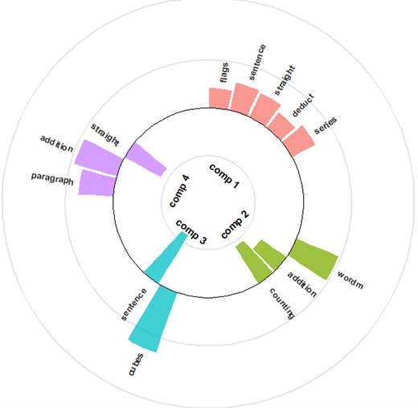

<!-- README.md is generated from README.Rmd. Please edit that file -->

```{r, include = FALSE}
knitr::opts_chunk$set(
  collapse = TRUE,
  comment = "#>",
  fig.path = "man/figures/README-"
)
#  ,out.width = "60%"
```


# Package spca

<!-- badges: start -->
[](https://github.com/merolagio/spca/actions/workflows/R-CMD-check.yaml)
<!-- [](LICENSE) -->
<!-- [](https://doi.org/10.5281/zenodo.18829364) -->
[](https://lifecycle.r-lib.org/articles/stages.html)
[]()
<!-- badges: end -->

This package contains functions to compute, print and plot Least Squares Sparse Principal Components Analysis (LS-SPCA)

The  main function *spca()* computes the sparse loadings and various statistics, such as the variance explained by each sparse component (sPC). print, summery and plot methods are available. 

Functions are new.spca (to create an `spca' object from a set of loadings and aggregate_by_scale to visualize the contribution by scale.

## Installation

You can install the development version of spca from [GitHub](https://github.com/) with:

``` r
# `remotes' is the lightest alternative
install.packages("remotes")
remotes::install_github("merolagio/spca")
#or
#install.packages("devtools")
devtools::install_github("merolagio/spca")
# or
# install.packages("pak")
pak::pak("merolagio/spca")
```

## Example

### load data
`holzinger` is the small classic Holzinger-Swineford dataset with 145 cases on 12 variables.
```{r load data, results = 'hide', message = FALSE, warning = FALSE, dpi = 300}
library(spca)
## basic example code
data(holzinger)
```
### Decide the number of components
```{r pca_checks, message = FALSE, warning = FALSE, fig.show="hold", out.width="47%", fig.width=4, fig.height=4}
ho_r = cor(holzinger)
ho_ee = eigen(ho_r)
spca_screeplot(ho_ee$value)
wachter_qqplot(ho_ee$values, p = ncol(holzinger), n = nrow(holzinger), nfit_line = -4)
```

### Compute PCA
```{r run_pca, message = FALSE, warning = FALSE}
ho_pca = pca(holzinger, ncomp = 4, screeplot = FALSE, wachter = FALSE)
summary(ho_pca)
```

### Compute the sparse loadings
Important parameters in the `spca` function are: $\alpha$ the minimum $R^2$ or the minimum proportion of cumulative vexp of the PCs reproduced by the sPCs; *ncomp* the number of components to compute; *method* the LS-SPCA method to use ("u" for uncorrelated, "c" for correlated and "p" for projection [default]); and *var_selection* ("stepwise" [default], "backward",  or "forward"). see the help for these parameters and more.

The following command computes four sPCs using forward variable selection with the cSPCA method so that each sPC as at least 0.95 squared correlation with the corresponding PC ($r > 0.9$).
```{r run_spca, message = FALSE, warning = FALSE}
myspca = spca(holzinger, alpha = 0.95, ncomps = 4)
```

### Inspect spca results
Methods are *print*, *plot* (several options available) and *summary*
```{r methods, message = FALSE, warning = FALSE, out.width="60%"}
myspca 

summary(myspca)

plot(myspca, plot_type = "bar")#, controls = list(var_names))
```

Other types of plots are available.

Circular, 
```{r circular, message = FALSE, warning = FALSE, fig.width = 5, fig.height = 3}
plot(myspca, plot_type = "circular") # "c" is enough to call "heatmap" type
```

Heatmap
```{r heatmap, message = FALSE, warning = FALSE, fig.width = 5, fig.height = 3}
plot(myspca, plot_type = "h") # "h" is enough to call "heatmap" type
```
