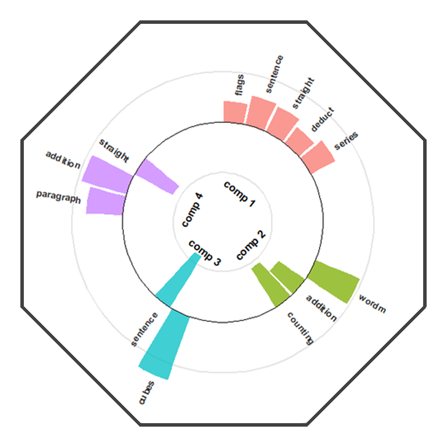

```{r, include = FALSE}
knitr::opts_chunk$set(
  collapse = TRUE,
  comment = "#>",
  fig.path = "man/figures/README-"
)
devtools::load_all(".")
#  ,out.width = "60%"
```


# Package spca

<!-- badges: start -->

[](https://github.com/merolagio/spca/actions/workflows/R-CMD-check.yaml)
[](https://github.com/merolagio/spca)
[](https://CRAN.R-project.org/package=spca)
[](https://www.gnu.org/licenses/agpl-3.0.en.html)
[](https://lifecycle.r-lib.org/articles/stages.html)
[](https://github.com/merolagio/spca)
<!-- badges: end -->

This package contains functions to compute, visualize and compare Least Squares Sparse Principal Components Analysis (LS-SPCA). Differently from other *conventional* SPCA methods, LS-SPCA provides a close approximation to the PCs, thus something like PCA with sparse weights. 

An efficient `C++` backend makes the fitting functions fast and memory efficient. Careful input validation and error handling prevents crashes and provides useful error and warning messages.

Methodological details, references and full presentation can be found in the *spca_extended* vignette.

## Installation
The stable release version can be installed from CRAN
``` {r inst_cran,  eval = FALSE}
install.packages("spca")
```

The current development version can be installed from GitHub with
``` {r inst_gib, eval = FALSE}
remotes::install_github("merolagio/spca")
```
## Usage
The  main function `spca()` computes the sparse weights and various statistics, such as the variance explained by each sparse component (sPC). In a typical LS-SPCA workflow, the number of sPCs to compute is chosen by examining visually the eigenvalues of the covariance/correlation matrix. These can be computed and stored in a compatible object of class `(pca, spca)`  with the function  `pca()`.

Different methods can be applied to class `spca` objects: additionally to standard `print()`, `summary()` and `plot()`, also `aggregate_by_group()` (to visualize the contribution by scale), `change_sign()` and `show_weights()`  and `show_correlations()` are available.  

The function `compare_spca()` compares two or more `spca` solutions, `aggregate_by_group()` summarizes weights or contributions by group, and `new_spca()` creates an `spca` object from a set of weights. Additional methods include `show_weights()`, which displays nonzero weights or contributions; `show_correlations()`, which displays correlations among sPCs and between sPCs and the corresponding PCs; and `change_sign()`, which changes the signs of selected components and their associated quantities. The functions `mp_qqplot()` and `scree_plot()` produce diagnostic plots from an object returned by `pca()`.

## Example

### Load data
The `holzinger` dataset is the small classic Holzinger-Swineford dataset with 145 cases on 12 variables grouped in 4 scales.
```{r load_data, echo = TRUE, message = FALSE, warning = FALSE}
library(spca)
data(holzinger)
dim(holzinger)
data(holzinger_scales)
holzinger_scales
```

### Preliminary PCA
```{r pca_checks, message = FALSE, warning = FALSE, fig.show="hold", out.width="47%", fig.width=4, fig.height=4}
ho_pca = pca(holzinger, screeplot =  TRUE, qq_plot = TRUE)
summary(ho_pca, cols = 10)
```

The screeplot would call for four components while the qqplot indicates three. We can settle for 4 components, ucknowledging that the fourth PC may be explaining mainly noise.

### Compute the sparse weights
Important parameters in the `spca()` function are: 

- `alpha` which controls the minimum the minimum proportion of ;
- `objective` sets which criterion is used to stop variable selection:
cumulative variance explained (RCVEXP) by the sPCs, relative to that explained by the corresponding PCs [default], or $R^2$ with the current PC; 
- `n_comps` the number of components to compute; 
- `method` the LS-SPCA method to use: "u" (for uncorrelated), "c" (for correlated) [default]) or "p" (for projection); 
- `var_selection` which variable selection to use "forward" [default], "stepwise", or "backward"). 


See the `spca` help for details on these and more parameters.

**The following command** computes four sPCs with default settings: `alpha = 0.95`, `var_selection = forward`, `method = "c"` that selects the `cSPCA` method. Hence, we expect each sPC to yield at least 95% cumulative VEXP, allowing some very mild correlation between sPCs.
```{r run_spca, message = FALSE, warning = FALSE}
ho_spca = spca(holzinger, n_comps = 4)
```

### Inspect spca results
Methods are `print`, `plot` (several options available) and `summary`.
By defaut, plot and print show the percentage `contributions`, that is the weights scaled to have sum of their absolute values equal to 1.
```{r methods, message = TRUE, warning = FALSE, fig.height = 5, fig.width = 5}
ho_spca # print

summary(ho_spca, cor_with_pc = TRUE)

plot(ho_spca, plot_type = "bar")

#sPCs correlation
show_correlations(ho_spca)
```

the sparse weights can be compared to the full PCA weights with `compare_spca`
```{r spca_vs_pca, message = FALSE, warning = FALSE, fig.width = 5, fig.height = 5}
compare_spca(list(ho_pca, ho_spca), variable_groups = holzinger_scales, 
             x_axis_var_names = FALSE,  methods_names = c("PCA", "SPCA")
             )
```

The `variable_groups = group_factor` adds lines separating variable groups. Adding  `print_weights = TRUE` would show the contributions side by side.

**Other plot types are available:**

Circular: 
```{r circular, message = FALSE, warning = FALSE, fig.width = 5, fig.height = 3}
plot(ho_spca, plot_type = "c") # "c" for "circular"
```

Heatmap:
```{r heatmap, message = FALSE, warning = FALSE, fig.width = 5, fig.height = 4}
plot(ho_spca, plot_type = "h", controls = list(legend_position = "b")) # "h" is enough to call "heatmap" type and "b" to indicate "bottom".
```

## Variable groups
The variables in the `holzinger` dataset belong to four different scales, recorded in the factor `holzinger_scales`. These can be differentiated in the barplot
```{r groups, message = FALSE, warning = FALSE, fig.width = 5, fig.height = 4}
plot(ho_spca, plot_type = "bars", variable_groups = holzinger_scales, controls = list(legend_position = "right")) 

aggregate_by_group(ho_spca, variable_groups = holzinger_scales)
```

## Comparison of two or more spca solutions
Compare the *CSPCA* solutions with *alpha = 0.95* those with  *alpha = 0.90*.
```{r spca90, message = FALSE, warning = FALSE, fig.width = 5, fig.height = 5}
ho_spca90 = spca(holzinger, n_comps = 4, alpha = 0.9)

compare_spca(obj_list = list(ho_spca, ho_spca90), 
             methods_names = c("alpha = 95", "alpha = 90"))
```


## Practical recommendations

The default settings provide a practical starting point for most analyses. Forward selection is recommended for routine use; stepwise and intensive selection are more suitable for smaller problems, while backward elimination can be expensive. The power method may be inaccurate, especially for higher order components, and is mainly useful for large matrices.

| Setting | Small | Medium | Large |
|:--|:--:|:--:|:--:|
| Stepwise selection | Consider | Consider | Avoid |
| Intensive selection | Consider | Use cautiously | Avoid |
| Backward elimination | Use cautiously | Avoid | Avoid |
| `objective = "cvexp"` | Consider | Consider | Use cautiously |
| Power method | Little expected gain | Little expected gain | Consider |

Matrix size refers mainly to the number of variables for the tall-matrix engine and to both dimensions for the fat-matrix engine. The recommendations concern computational cost rather than guaranteed improvements in the solution.
```