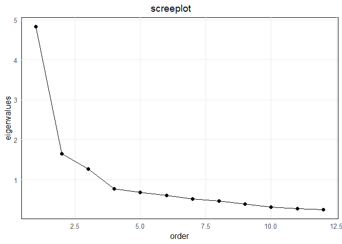
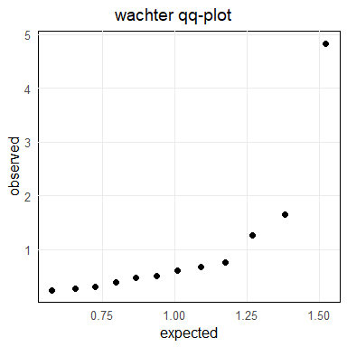
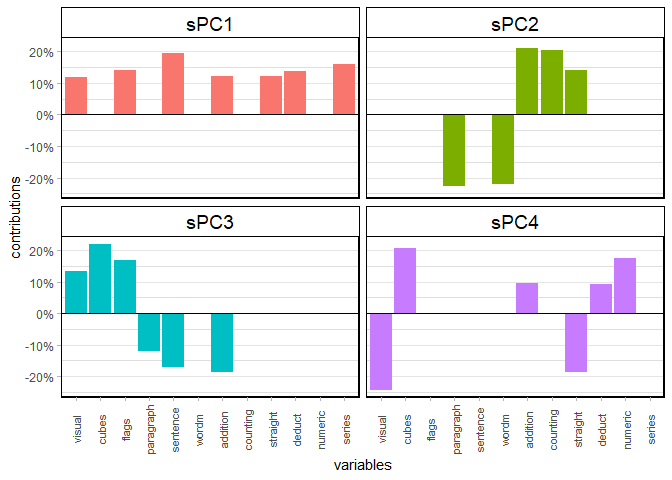
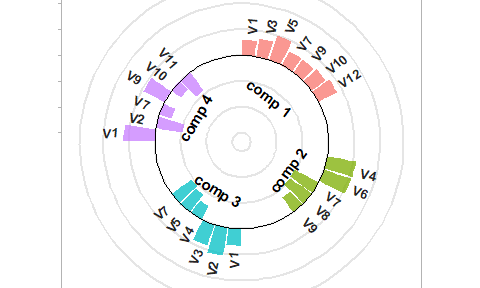
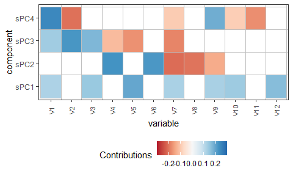
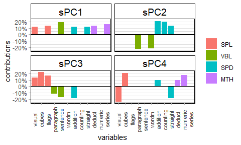
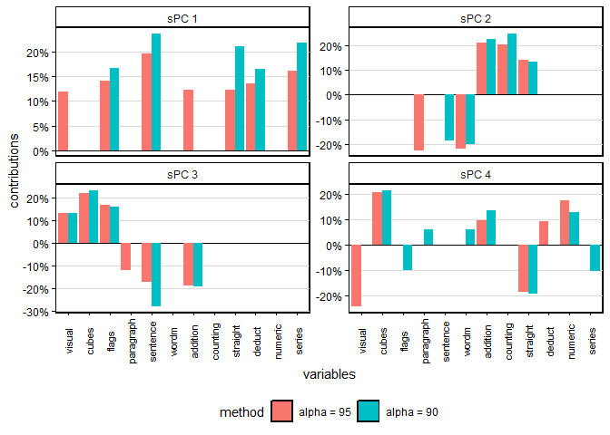

<!-- README.md is generated from README.Rmd. Please edit that file -->


# Package spca

<!-- badges: start -->

[](https://github.com/merolagio/spca/actions/workflows/R-CMD-check.yaml)
[](https://www.gnu.org/licenses/agpl-3.0.en.html)
[](https://lifecycle.r-lib.org/articles/stages.html)
[](https://github.com/merolagio/spca)
<!-- badges: end -->

This package contains functions to compute, print and plot Least Squares
Sparse Principal Components Analysis (LS-SPCA). Methodological details,
references and full presentation can be found in the extended_vignette
document.

## Installation

You can install the stable release version from CRAN

``` r
install.packages("spca")
#or
https://github.com/merolagio/spca/releases/tag/CRAN_submission
```

The current development version from GitHub

``` r
remotes::install_github("merolagio/spca")
```

## Usage

The main function *spca()* computes the sparse loadings and various
statistics, such as the variance explained by each sparse component
(sPC). print, summery and plot methods are available. PCA solutions
stored as an `*spca*` object cn be obtained with the function *pca()*.

Utilities available are
*compare_spca()*`(to compare two or more spca solutions), *aggregate_by_scale()* (to visualize the contribution by scale) and *new.spca()* (to create an`spca\`
object from a set of loadings).

## Example

### Load data

The `holzinger` dataset is the small classic Holzinger-Swineford dataset
with 145 cases on 12 variables grouped in 4 scales.

``` r
library(spca)
data(holzinger)
dim(holzinger)
#> [1] 145  12
holzinger_scales
#>  [1] SPL SPL SPL VBL VBL VBL SPD SPD SPD MTH MTH MTH
#> Levels: SPL VBL SPD MTH
```

### Preliminary PCA

``` r
ho_pca = pca(holzinger, screeplot =  TRUE, qq_plot = TRUE)
summary(ho_pca,cols = 10)
#>          sPC1   sPC2   sPC3   sPC4   sPC5   sPC6   sPC7   sPC8   sPC9  sPC10
#> Vexp    40.2%  13.7%  10.6%   6.4%   5.6%   5.1%   4.3%   3.9%   3.2%   2.6%
#> Cvexp   40.2%  53.9%  64.5%  70.9%  76.5%  81.6%  85.9%  89.8%  93.0%  95.6%
#> Rvexp  100.0% 100.0% 100.0% 100.0% 100.0% 100.0% 100.0% 100.0% 100.0% 100.0%
#> Rcvexp 100.0% 100.0% 100.0% 100.0% 100.0% 100.0% 100.0% 100.0% 100.0% 100.0%
#> Card       12     12     12     12     12     12     12     12     12     12
```


We settle for 4 components

### Compute the sparse loadings

Important parameters in the *spca()* function are: *alpha* which
controls for the minimum $`R^2`$ \[default\]) or the minimum proportion
of cumulative variance explained (VEXP) by the sPCs realtive to that
explained by the corresponding PCs; *n_comps* the number of components
to compute; *method* the LS-SPCA method to use (“u” for uncorrelated,
“c” for correlated \[default\]) and “p” for projection; *var_selection*
(“forward” \[default\], “stepwise”, or “backward”). See the `**spca**`
help for details on these parameters and more.

The following command computes four sPCs with default settings: *alpha =
0.95*, *var_selection = forward*, *method = “c”* that selects the
*cSPCA* method. Hence, we expect each sPC to yield at least 0.95%
cumulative VEXP, allowing some very mild correlation between sPCs.

``` r
myspca = spca(holzinger, n_comps = 4)
```

### Inspect spca results

Methods are *print*, *plot* (several options available) and *summary*.
By defaut, plot and print show the percentage *contributions*, that is
the loadings scaled to have sum of their absolute values equal to 1.

``` r
myspca # print
#> Contributions (%)
#>             sPC1   sPC2   sPC3   sPC4
#> visual     11.9%         13.2% -24.2%
#> cubes                    22.1%  20.8%
#> flags      14.2%         17.0%       
#> paragraph        -22.6% -11.9%       
#> sentence   19.6%        -17.2%       
#> wordm            -21.9%              
#> addition   12.2%  21.2% -18.5%   9.6%
#> counting          20.3%              
#> straight   12.3%  14.0%        -18.6%
#> deduct     13.7%                 9.3%
#> numeric                         17.5%
#> series     16.1%                     
#>            -----  -----  -----  -----
#> Cvexp      38.6%  51.9%  62.3%  68.8%
#> 

summary(myspca, cor_with_pc = TRUE)
#>          sPC1   sPC2   sPC3   sPC4
#> Vexp    38.6%  13.3%  10.4%   6.4%
#> Cvexp   38.6%  51.9%  62.3%  68.8%
#> Rvexp   96.0%  97.3%  98.3% 100.6%
#> Rcvexp  96.0%  96.3%  96.7%  97.0%
#> Card        7      5      6      6
#> r       0.978  0.973  0.979 -0.876

plot(myspca, plot_type = "bar")
```



``` r

#sPCs correlation
round(myspca$spc_cor, 2)
#>       sPC1  sPC2  sPC3  sPC4
#> sPC1  1.00  0.03 -0.01  0.02
#> sPC2  0.03  1.00 -0.01 -0.01
#> sPC3 -0.01 -0.01  1.00 -0.01
#> sPC4  0.02 -0.01 -0.01  1.00
```

Other plot types are available.

Circular:

``` r
plot(myspca, plot_type = "c") # "c" for "circular"
```

<!-- -->

Heatmap:

``` r
plot(myspca, plot_type = "h", controls = list(legend_position = "b")) # "h" is enough to call "heatmap" type and "b" to indicate "bottom".
```

<!-- -->

## Variable groups

The variables in the `holzinger` dataset belong to four different
scales, recorded in the factor `holzinger_scales`. These can be
differenciated in the barplot

``` r
plot(myspca, plot_type = "bars", variable_groups = holzinger_scales, controls = list(legend_position = "right")) 
```

<!-- -->

``` r

aggregate_by_group(myspca,groups = holzinger_scales)
#> [1] "percentage contributions"
#>      sPC1   sPC2   sPC3  sPC4
#> SPL 26.0%         52.4% -3.5%
#> VBL 19.6% -44.5% -29.1%      
#> SPD 24.6%  55.5% -18.5% -8.9%
#> MTH 29.8%               26.8%
```

## Comparison of two or more spca solutions

Compare the *CSPCA* solutions with *alpha = 0.95* those with *alpha =
0.90*.

``` r
myspca90 = spca(holzinger, n_comps = 4, alpha = 0.9)

compare_spca(obj_list = list(myspca, myspca90), 
             methods_names = c("alpha = 95", "alpha = 90"))
```

<!-- -->

    #> [1] "Percentage Contributions"
    #>           C1.M1 C1.M2 C2.M1 C2.M2 C3.M1 C3.M2 C4.M1 C4.M2
    #> visual     11.9                    13.2  13.3 -24.2      
    #> cubes                              22.1  23.4  20.8  21.5
    #> flags      14.2  16.6                17  16.2         -10
    #> paragraph             -22.6       -11.9               6.2
    #> sentence   19.6  23.7       -18.8 -17.2 -27.9            
    #> wordm                 -21.9 -20.1                     6.2
    #> addition   12.2        21.2  22.7 -18.5 -19.1   9.6  13.6
    #> counting               20.3  24.8                        
    #> straight   12.3  21.1    14  13.5             -18.6 -19.2
    #> deduct     13.7  16.6                           9.3      
    #> numeric                                        17.5  12.9
    #> series     16.1  21.9                               -10.4
    #>  
    #> [1] Summary statistics
    #>        C1.M1  C1.M2  C2.M1  C2.M2  C3.M1  C3.M2  C4.M1  C4.M2 
    #> Vexp    38.6%  37.3%  13.3%  13.2%  10.4%  10.1%   6.4%   6.6%
    #> Cvexp   38.6%  37.3%  51.9%  50.5%  62.3%  60.6%  68.8%  67.2%
    #> Rvexp   96.0%  92.8%  97.3%  96.6%  98.3%  95.3% 100.6% 102.7%
    #> Rcvexp  96.0%  92.8%  96.3%  93.7%  96.7%  94.0%  97.0%  94.8%
    #> Card        7      5      5      5      6      5      6      8
    #> abs_r    0.98   0.96   0.97   0.96   0.98   0.96   0.88   0.56
