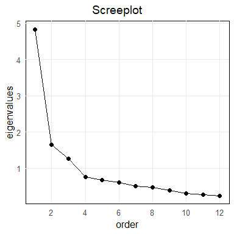
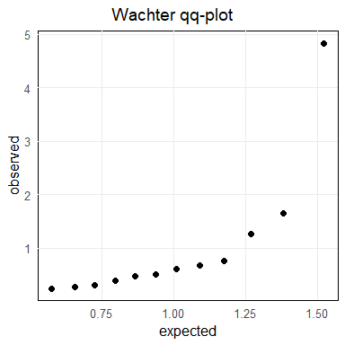
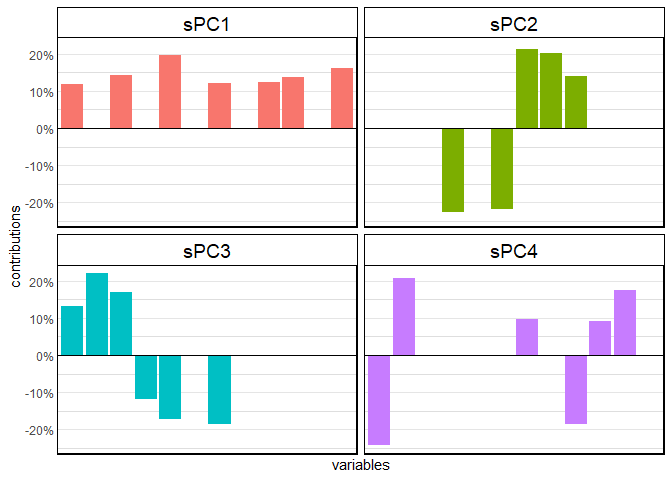
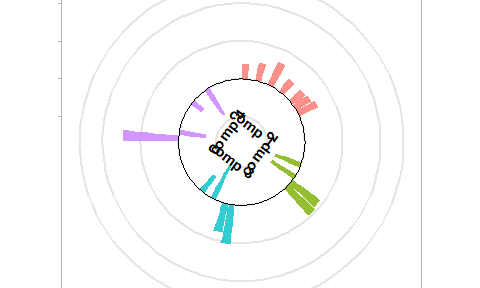
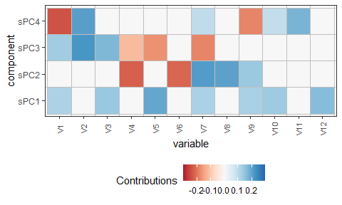
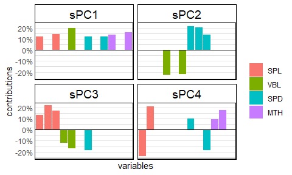
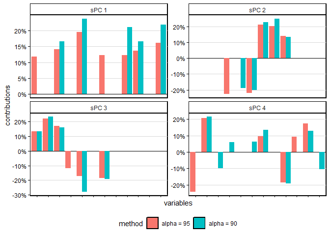

<!-- README.md is generated from README.Rmd. Please edit that file -->


# Package spca

<!-- badges: start -->

[](https://github.com/merolagio/spca/actions/workflows/R-CMD-check.yaml)
[](https://CRAN.R-project.org/package=spca)
[](https://www.gnu.org/licenses/agpl-3.0.en.html)
[](https://lifecycle.r-lib.org/articles/stages.html)
[](https://github.com/merolagio/spca)
<!-- badges: end -->

This package contains functions to compute, visualize and compare Least
Squares Sparse Principal Components Analysis (LS-SPCA). Differently from
other *conventional* SPCA methods, LS-SPCA provides a close
approximation to the PCs, thus something like PCA with sparse weights.

An efficient `C++` backend makes the fitting functions fast and memory
efficient. Careful input validation and error handling prevents crashes
and provides useful error and warning messages.

Methodological details, references and full presentation can be found in
the *spca_extended* vignette.

## Installation

The stable release version can be installed from CRAN

``` r
install.packages("spca")
```

The current development version can be installed from GitHub with

``` r
remotes::install_github("merolagio/spca")
```

## Usage

The main function *spca()* computes the sparse weights and various
statistics, such as the variance explained by each sparse component
(sPC). In a typical LS-SPCA workflow, the number of sPCs to compute is
chosen by examining visually the eigenvalues of the covariance matrix.
These can be computed and stored in a compatible object of class *spca*
with the function *pca()*.

Different methods can be applied to class *spca* objects: additionally
to standard *print()*, *summary()* and *plot()*, also
*aggregate_by_group()* (to visualize the contribution by scale),
*change_sign()* and *show_weights()* are available.

The function `compare_spca()` compares two or more `spca` solutions,
`aggregate_by_group()` summarizes weights or contributions by group, and
`new_spca()` creates an `spca` object from a set of weights. Additional
methods include `show_weights()`, which displays nonzero weights or
contributions; `show_correlations()`, which displays correlations among
sPCs and between sPCs and the corresponding PCs; and `change_sign()`,
which changes the signs of selected components and their associated
quantities. The functions `qqplot_spca()` and `screeplot_spca()` produce
diagnostic plots from an object returned by `pca()`.

## Example

### Load data

The `holzinger` dataset is the small classic Holzinger-Swineford dataset
with 145 cases on 12 variables grouped in 4 scales.

``` r
library(spca)
data(holzinger)
dim(holzinger)
#> [1] 145  12
holzinger_scales
#>  [1] SPL SPL SPL VBL VBL VBL SPD SPD SPD MTH MTH MTH
#> Levels: SPL VBL SPD MTH
```

### Preliminary PCA

``` r
ho_pca = pca(holzinger, screeplot =  TRUE, qq_plot = TRUE)
summary(ho_pca,cols = 10)
#>          sPC1   sPC2   sPC3   sPC4   sPC5   sPC6   sPC7   sPC8   sPC9  sPC10
#> Vexp    40.2%  13.7%  10.6%   6.4%   5.6%   5.1%   4.3%   3.9%   3.2%   2.6%
#> Cvexp   40.2%  53.9%  64.5%  70.9%  76.5%  81.6%  85.9%  89.8%  93.0%  95.6%
#> Rvexp  100.0% 100.0% 100.0% 100.0% 100.0% 100.0% 100.0% 100.0% 100.0% 100.0%
#> Rcvexp 100.0% 100.0% 100.0% 100.0% 100.0% 100.0% 100.0% 100.0% 100.0% 100.0%
#> Card       12     12     12     12     12     12     12     12     12     12
#> r       1.000  1.000  1.000  1.000  1.000  1.000  1.000  1.000  1.000  1.000
```



We can settle for 4 components

### Compute the sparse weights

Important parameters in the *spca()* function are: *alpha* which
controls for the minimum $`R^2`$ \[default\]) or the minimum proportion
of cumulative variance explained (VEXP) by the sPCs realtive to that
explained by the corresponding PCs; *n_comps* the number of components
to compute; *method* the LS-SPCA method to use (“u” for uncorrelated,
“c” for correlated \[default\]) and “p” for projection; *var_selection*
(“forward” \[default\], “stepwise”, or “backward”). See the **spca**\`
help for details on these parameters and more.

The following command computes four sPCs with default settings: *alpha =
0.95*, *var_selection = forward*, *method = “c”* that selects the
*cSPCA* method. Hence, we expect each sPC to yield at least 0.95%
cumulative VEXP, allowing some very mild correlation between sPCs.

``` r
myspca = spca(holzinger, n_comps = 4)
```

### Inspect spca results

Methods are *print*, *plot* (several options available) and *summary*.
By default, plot and print show the percentage *contributions*, that is
the weights scaled to have sum of their absolute values equal to 1.

``` r
myspca # print
#> Percentage contributions
#>             sPC1   sPC2   sPC3   sPC4
#> visual     11.9%         13.2% -24.2%
#> cubes                    22.1%  20.8%
#> flags      14.2%         17.0%       
#> paragraph        -22.6% -11.9%       
#> sentence   19.6%        -17.2%       
#> wordm            -21.9%              
#> addition   12.2%  21.2% -18.5%   9.6%
#> counting          20.3%              
#> straight   12.3%  14.0%        -18.6%
#> deduct     13.7%                 9.3%
#> numeric                         17.5%
#> series     16.1%                     
#>            -----  -----  -----  -----
#> Cvexp      38.6%  51.9%  62.3%  68.8%
#> 

summary(myspca, cor_with_pc = TRUE)
#>          sPC1   sPC2   sPC3   sPC4
#> Vexp    38.6%  13.3%  10.4%   6.4%
#> Cvexp   38.6%  51.9%  62.3%  68.8%
#> Rvexp   96.0%  97.3%  98.3% 100.6%
#> Rcvexp  96.0%  96.3%  96.7%  97.0%
#> Card        7      5      6      6
#> r       0.978  0.973  0.979 -0.876
```

The sPCs explain over 96% of the variance explained by the corresponding
full-cardinality PC whith which they are highly correlated.

``` r
plot(myspca, plot_type = "bar")
```



``` r

#sPCs correlation
show_correlations(myspca)
#>         sPC1  sPC2  sPC3  sPC4
#> sPC1    1.00  0.03 -0.01  0.02
#> sPC2    0.03  1.00 -0.01 -0.01
#> sPC3   -0.01 -0.01  1.00 -0.01
#> sPC4    0.02 -0.01 -0.01  1.00
#>        ----- ----- ----- -----
#> sPC-PC  0.98  0.97  0.98 -0.88
#round(myspca$spc_cor, 2)
```

The sPCs are virtually uncorrelated.

Other plot types are available.

Circular:

``` r
plot(myspca, plot_type = "c") # "c" for "circular"
```

<!-- -->

Heatmap:

``` r
plot(myspca, plot_type = "h", controls = list(legend_position = "b")) # "h" is enough to call "heatmap" type and "b" to indicate "bottom".
```

<!-- -->

## Variable groups

The variables in the `holzinger` dataset belong to four different
scales, recorded in the factor `holzinger_scales`. These can be
differentiated in the barplot

``` r
plot(myspca, plot_type = "bars", variable_groups = holzinger_scales, controls = list(legend_position = "right")) 
```

<!-- -->

``` r

aggregate_by_group(myspca, groups = holzinger_scales)
#>      sPC1   sPC2   sPC3  sPC4
#> SPL 26.0%         52.4% -3.5%
#> VBL 19.6% -44.5% -29.1%      
#> SPD 24.6%  55.5% -18.5% -8.9%
#> MTH 29.8%               26.8%
```

## Comparison of two or more spca solutions

Compare the *cSPCA* solutions computed with *alpha = 0.95* computed with
those with *alpha = 0.90*.

``` r
myspca90 = spca(holzinger, n_comps = 4, alpha = 0.9)

compare_spca(obj_list = list(myspca, myspca90), 
             methods_names = c("alpha = 95", "alpha = 90"))
```

<!-- -->

    #>        C1.M1  C1.M2  C2.M1  C2.M2  C3.M1  C3.M2  C4.M1  C4.M2 
    #> Vexp    38.6%  37.3%  13.3%  13.2%  10.4%  10.1%   6.4%   6.6%
    #> Cvexp   38.6%  37.3%  51.9%  50.5%  62.3%  60.6%  68.8%  67.2%
    #> Rvexp   96.0%  92.8%  97.3%  96.6%  98.3%  95.3% 100.6% 102.7%
    #> Rcvexp  96.0%  92.8%  96.3%  93.7%  96.7%  94.0%  97.0%  94.8%
    #> Card        7      5      5      5      6      5      6      8
    #> abs_r    0.98   0.96   0.97   0.96   0.98   0.96   0.88   0.56
