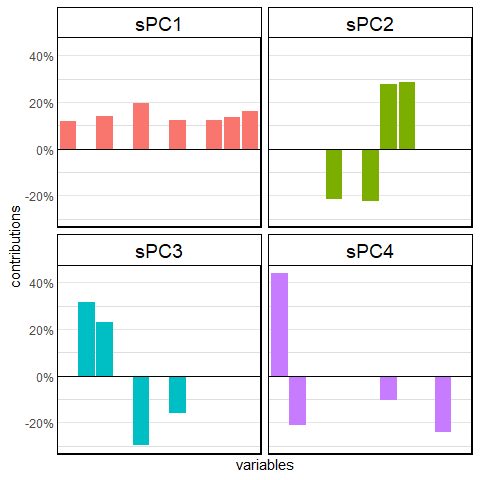
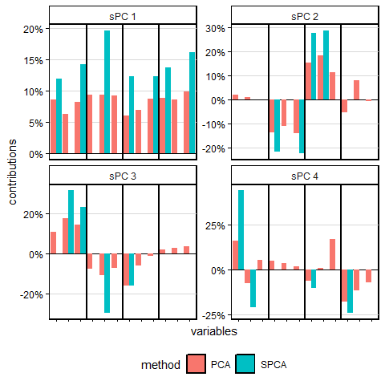

# Package spca

<!-- badges: start -->

[](https://github.com/merolagio/spca/actions/workflows/R-CMD-check.yaml)
[](https://github.com/merolagio/spca)
[](https://CRAN.R-project.org/package=spca)
[](https://www.gnu.org/licenses/agpl-3.0.en.html)
[](https://lifecycle.r-lib.org/articles/stages.html)
[](https://github.com/merolagio/spca)
<!-- badges: end -->

This package contains functions to compute, visualize and compare Least
Squares Sparse Principal Components Analysis (LS-SPCA). Differently from
other *conventional* SPCA methods, LS-SPCA provides a close
approximation to the PCs, thus something like PCA with sparse weights.

An efficient `C++` backend makes the fitting functions fast and memory
efficient. Careful input validation and error handling prevents crashes
and provides useful error and warning messages.

Methodological details, references and full presentation can be found in
the *spca_extended* vignette.

## Installation

The stable release version can be installed from CRAN

``` r
install.packages("spca")
```

The current development version can be installed from GitHub with

``` r
remotes::install_github("merolagio/spca")
```

## Usage

The main function `spca()` computes the sparse weights and various
statistics, such as the variance explained by each sparse component
(sPC). In a typical LS-SPCA workflow, the number of sPCs to compute is
chosen by examining visually the eigenvalues of the
covariance/correlation matrix. These can be computed and stored in a
compatible object of class `(pca, spca)` with the function `pca()`.

Different methods can be applied to class `spca` objects: additionally
to standard `print()`, `summary()` and `plot()`, also
`aggregate_by_group()` (to visualize the contribution by scale),
`change_sign()` and `show_weights()` and `show_correlations()` are
available.

The function `compare_spca()` compares two or more `spca` solutions,
`aggregate_by_group()` summarizes weights or contributions by group, and
`new_spca()` creates an `spca` object from a set of weights. Additional
methods include `show_weights()`, which displays nonzero weights or
contributions; `show_correlations()`, which displays correlations among
sPCs and between sPCs and the corresponding PCs; and `change_sign()`,
which changes the signs of selected components and their associated
quantities. The functions `mp_qqplot()` and `scree_plot()` produce
diagnostic plots from an object returned by `pca()`.

## Example

### Load data

The `holzinger` dataset is the small classic Holzinger-Swineford dataset
with 145 cases on 12 variables grouped in 4 scales.

``` r
library(spca)
data(holzinger)
dim(holzinger)
#> [1] 145  12
data(holzinger_scales)
holzinger_scales
#>  [1] SPL SPL SPL VBL VBL VBL SPD SPD SPD MTH MTH MTH
#> Levels: SPL VBL SPD MTH
```

### Preliminary PCA

``` r
ho_pca = pca(holzinger, screeplot =  TRUE, qq_plot = TRUE)
summary(ho_pca, cols = 10)
#>         PC1   PC2   PC3   PC4   PC5   PC6   PC7   PC8   PC9  PC10
#> Vexp  40.2% 13.7% 10.6%  6.4%  5.6%  5.1%  4.3%  3.9%  3.2%  2.6%
#> Cvexp 40.2% 53.9% 64.5% 70.9% 76.5% 81.6% 85.9% 89.8% 93.0% 95.6%
#> Card     12    12    12    12    12    12    12    12    12    12
```


The screeplot would call for four components while the qqplot indicates
three. We can settle for 4 components, ucknowledging that the fourth PC
may be explaining mainly noise.

### Compute the sparse weights

Important parameters in the `spca()` function are:

- `alpha` which controls the minimum the minimum proportion of ;
- `objective` sets which criterion is used to stop variable selection:
  cumulative variance explained (RCVEXP) by the sPCs, relative to that
  explained by the corresponding PCs \[default\], or $`R^2`$ with the
  current PC;
- `n_comps` the number of components to compute;
- `method` the LS-SPCA method to use: “u” (for uncorrelated), “c” (for
  correlated) \[default\]) or “p” (for projection);
- `var_selection` which variable selection to use “forward” \[default\],
  “stepwise”, or “backward”).

See the `spca` help for details on these and more parameters.

**The following command** computes four sPCs with default settings:
`alpha = 0.95`, `var_selection = forward`, `method = "c"` that selects
the `cSPCA` method. Hence, we expect each sPC to yield at least 95%
cumulative VEXP, allowing some very mild correlation between sPCs.

``` r
ho_spca = spca(holzinger, n_comps = 4)
```

### Inspect spca results

Methods are `print`, `plot` (several options available) and `summary`.
By defaut, plot and print show the percentage `contributions`, that is
the weights scaled to have sum of their absolute values equal to 1.

``` r
ho_spca # print
#> Percentage contributions
#>             sPC1   sPC2   sPC3   sPC4
#> visual     11.9%                43.9%
#> cubes                    31.4% -21.3%
#> flags      14.2%         23.0%       
#> paragraph        -21.6%              
#> sentence   19.6%        -29.7%       
#> wordm            -22.3%              
#> addition   12.2%  27.5% -15.9% -10.6%
#> counting          28.6%              
#> straight   12.3%                     
#> deduct     13.7%               -24.3%
#> series     16.1%                     
#>            -----  -----  -----  -----
#> Cvexp      38.6%  51.5%  61.4%  67.5%
#> 

summary(ho_spca, cor_with_pc = TRUE)
#>         sPC1  sPC2  sPC3  sPC4
#> Vexp   38.6% 12.9%  9.9%  6.1%
#> Cvexp  38.6% 51.5% 61.4% 67.5%
#> Rvexp  96.0% 94.5% 93.5% 95.3%
#> Rcvexp 96.0% 95.6% 95.3% 95.3%
#> Card       7     4     4     4
#> r      0.978 0.946 0.925 0.762

plot(ho_spca, plot_type = "bar")
```

<!-- -->

``` r

#sPCs correlation
show_correlations(ho_spca)
#>         sPC1  sPC2  sPC3  sPC4
#> sPC1    1.00 -0.01 -0.03 -0.02
#> sPC2   -0.01  1.00 -0.08 -0.10
#> sPC3   -0.03 -0.08  1.00 -0.06
#> sPC4   -0.02 -0.10 -0.06  1.00
#>        ----- ----- ----- -----
#> sPC-PC  0.98  0.95  0.92  0.76
```

the sparse weights can be compared to the full PCA weights with
`compare_spca`

``` r
compare_spca(list(ho_pca, ho_spca), variable_groups = holzinger_scales, 
             x_axis_var_names = FALSE,  methods_names = c("PCA", "SPCA")
             )
```

<!-- -->

    #>        C1.M1  C1.M2  C2.M1  C2.M2  C3.M1  C3.M2  C4.M1  C4.M2 
    #> Vexp    40.2%  38.6%  13.7%  12.9%  10.6%   9.9%   6.4%   6.1%
    #> Cvexp   40.2%  38.6%  53.9%  51.5%  64.5%  61.4%  70.9%  67.5%
    #> Rvexp  100.0%  96.0% 100.0%  94.5% 100.0%  93.5% 100.0%  95.3%
    #> Rcvexp 100.0%  96.0% 100.0%  95.6% 100.0%  95.3% 100.0%  95.3%
    #> Card       12      7     12      4     12      4     12      4
    #> abs_r    1.00   0.98   1.00   0.95   1.00   0.92   1.00   0.76

The `variable_groups = group_factor` adds lines separating variable
groups. Adding `print_weights = TRUE` would show the contributions side
by side.

**Other plot types are available:**

Circular:

``` r
plot(ho_spca, plot_type = "c") # "c" for "circular"
```

<!-- -->

Heatmap:

``` r
plot(ho_spca, plot_type = "h", controls = list(legend_position = "b")) # "h" is enough to call "heatmap" type and "b" to indicate "bottom".
```

<!-- -->

## Variable groups

The variables in the `holzinger` dataset belong to four different
scales, recorded in the factor `holzinger_scales`. These can be
differentiated in the barplot

``` r
plot(ho_spca, plot_type = "bars", variable_groups = holzinger_scales, controls = list(legend_position = "right")) 
```

<!-- -->

``` r

aggregate_by_group(ho_spca, variable_groups = holzinger_scales)
#>      sPC1   sPC2   sPC3   sPC4
#> SPL 26.0%         54.4%  22.6%
#> VBL 19.6% -43.9% -29.7%       
#> SPD 24.6%  56.1% -15.9% -10.6%
#> MTH 29.8%               -24.3%
```

## Comparison of two or more spca solutions

Compare the *CSPCA* solutions with *alpha = 0.95* those with *alpha =
0.90*.

``` r
ho_spca90 = spca(holzinger, n_comps = 4, alpha = 0.9)

compare_spca(obj_list = list(ho_spca, ho_spca90), 
             methods_names = c("alpha = 95", "alpha = 90"))
```

<!-- -->

    #>        C1.M1 C1.M2 C2.M1 C2.M2 C3.M1 C3.M2 C4.M1 C4.M2
    #> Vexp   38.6% 37.3% 12.9% 11.2%  9.9%  9.9%  6.1%  6.3%
    #> Cvexp  38.6% 37.3% 51.5% 48.5% 61.4% 58.4% 67.5% 64.7%
    #> Rvexp  96.0% 92.8% 94.5% 81.9% 93.5% 93.4% 95.3% 97.8%
    #> Rcvexp 96.0% 92.8% 95.6% 90.0% 95.3% 90.6% 95.3% 91.2%
    #> Card       7     5     4     2     4     4     4     3
    #> abs_r   0.98  0.96  0.95  0.87  0.92  0.94  0.76  0.08
