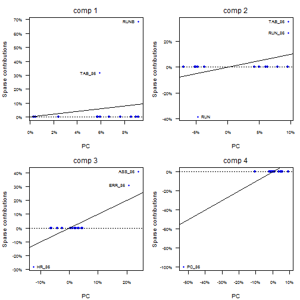
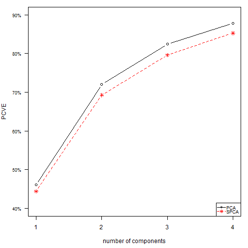

<!-- README.md is generated from README.Rmd. Please edit that file -->  


### Intro  
`spca` is an R package for running Sparse Principal Component Analysis. It implements the LS SPCA approach that computes the Least Squares estimates of sparse PCs ([Merola, 2014. arXiv](http://arxiv.org/abs/1406.1381 "Pre-print")). Unlike other SPCA methods, these solutions maximise the variance of the data explained. 


I had difficulties publishing the LS SPCA paper, possibly because LS SPCA improves on existing methods. This is confirmed by the fact that Technometrics' chief editor, Dr Qiu, rejected the paper endorsing a report stating that: **the LS criterion is a new measure used ad-hoc  :-D** This on top of a number of blatantly wrong arguments.  I am now waiting for the response of a reviewer who asked me to **compare the about 20 existing SPCA methods with mine on more datasets** (only because I show that my solutions maximise the variance explained and theirs don't)!    

### Sparse Principal Component Analysis
Principal Component Analysis is used for analysing a multivariate dataset with two or three uncorrelated components that explain the most variance of the data. 

In some situations more than three components are used. But this simply reduces a problem into a lower dimensional one, which is still difficult to analyse.

SPCA aims to obtain interpretable components.  In Factor Analysis literature there is plenty of discussion about the  definition of interpretable and simple solutions (as qualities and in mathematical terms).

* **Simplicity** can be defined by different measures, being linked to **sparsness**, **variance explained** and **size of the loadings**. 

* **interpretability** is, instead, also linked to **which variables are included** in the solution  and is not measurable.
    * it usually requires **expert knowledge**.

For these reasons, usually there exist different competing solutions and it is necessary to choose the *best* ones among these. You can think of this as a sort of model selection in regression analysis.

### Optimisation Models  
Finding the optimal indices for an *spca* solution is an intractable NP-hard problem.  

Therefore, we find the solutions through two greedy algorthms: Branch-and-Bound (**BB**) and Backward Elimination (**BE**).

* **BB** searches for the solutions that sequentially maximise the variance explained under the constraints. The solutions may not be a global maximum when more than one component is computed. The BB algorithm is a modification of Farcomeni's (2010) (thanks!).

* **BE** has the goal of attaining larger contributions while minimising the LS criteria. It sequentially eliminates the smallest contributions (in absolute value) from a non-sparse solution. This will generally lead to explaining less variance than the **BB** search. However, the **BE** algorithm is much faster than the **BB** one, and the solutions usually have large loadings.

The **BE** algorthm is illustrated in `vignettes("BE algorithm", package = "spca")`

### Use of the package

**spca aims to obtain interpretable solutions**

Choosing an interpretable sparse solution requires comparing two or more of them, which may differ by the variables included or the cardinality and may explain more or less variance. Therefore, it is necessary to analyse more than one and this implies comparing statistics and plots. 
 
**spca is implemented as an exploratory data analysis tool** 

The cardinality of the components can be chosen interactively after inspecting trace and plots of solutions of different cardinality.

Furthermore, the solutions can be automatically computed so as to:

* be uncorrelated with the others or not.

* have a minimal cardinality. 

* reproduce a given proportion of the variance explained by the full PCs. 

* have only contributions larger than a given threshold.

Solutions obtained under different settings can be easily compared.

`spca` can be helpful also in a confirmatory stage of the analysis, since the sparse components can be constrained to be made up of only chosen variables.

Beside this quick tour of the package, there are vignettes with examples and explanations. You can start with `vignette("Introduction to spca", package = "spca"), which is similar to this but more detailed.` Other vignettes contain an extended example and a navigable help. 

### Functions
The workhorse of the package is the function `spca`, which computes the optimal solutions for a given set of indices.

The functions `spcabb` and `spcabe` implement the **BB** and **BE** searches, rispectively.

The package contains methods for plotting, printing and comparing spca solutions.

With`help(spcabb)` and `help(spcabe)` you will find examples of using spca and the utilities. Calling `vignettes("Advanced Example", package = "spca")` you will find a more complete example and details on the methods.

### Methods

- `choosecard`: interactive method for choosing the cardinality. It plots and prints statistics for comparing solutions of different cardinality.

- `print`: shows a formatted matrix of sparse loadings or *contributions* of a solution. Contributions are loadings expressed as percentages, while the loadings are scaled to unit sum of squares.

- `showload`: prints only the non-zero sparse loadings. This is useful when the number of variables is large.

- `summary`: shows formatted summary statistics of a solution

- `plot`: plots the cumulative variance explained by the sparse solutions versus that explained by the PCs, whish is their upper bound. It can also plot the contributions in different ways.

- `compare`: plots and prints comparison of two or more *spca* objects.

### Example

The naming of the arguments in R is not simple, mainly because different syntaxes have been used over the years. I tried to follow [Harley Wickam's suggestions](http://r-pkgs.had.co.nz/style.html), not completely. I tried to use consistent argument names in different functions and to give meaningful names starting differently so that R's useful feature of partial matching the arguments can be exploited. In the following example I sometime use partial arguments names.


```r
library(spca)
data(bsbl)
#Ordinary PCA
bpca = pca(bsbl, screeplot = FALSE, kaiser.print = TRUE)
```

```
## [1] "number of eigenvalues larger than 1 is 3"
```

```r
#-Sparse PCA
bbe1 <- spcabe(bsbl, nd = 4, thresh = 0.25, unc = FALSE)

#-summary output
summary(bbe1) 
```

```
##            Comp1 Comp2 Comp3 Comp4
## PVE        44.4% 24.9% 10.3% 5.6% 
## PCVE       44.4% 69.3% 79.6% 85.2%
## PRCVE      96.4% 96.1% 96.6% 97.1%
## Card       2     3     3     1    
## Ccard      2     5     8     9    
## PVE/Card   22.2% 8.3%  3.4%  5.6% 
## PCVE/Ccard 22.2% 13.9% 10%   9.5% 
## Converged  0     0     0     0    
## MinCont    31.5% 26.3% 28.2% 100%
```

```r
#-# Explaining over 96% of the variance explained by PCA with 2, 3, 3 and 1 variables.

#-print percentage contributions
bbe1
```

```
## Percentage Contributions
```

```
##        Comp1 Comp2 Comp3 Comp4
## TAB_86  31.5  35.2            
## HR_86               28.2      
## RUN_86        26.3            
## RUN          -38.5            
## RUNB    68.5                  
## PO_86                      100
## ASS_86             -40.9      
## ERR_86             -30.9      
##        ----- ----- ----- -----
## PCVE   44.4  69.3  79.6  85.2 
## 
```

```r
#-# Simple combinations of offensive play in career and season are most important. Defensive play in season appears only in 3rd component.

#-plot solution
plot(bbe1, plotloadvsPC = TRUE, pc = bpca, mfr = 2, mfc = 2, 
               variablesnames = TRUE)
```



```r
#-# Explaining the variance pretty closely to PCA with much fewer variables.
```


### Installing the package

* the latest released version from CRAN with

```R
install.packages("spca")
````

* The latest development version from github with

```R
if (packageVersion("spca") < 0.4.0) {
  install.packages("devtools")
}
devtools::install_github("merolagio/spca")
```

###Comments
This is the first release and will surely contain some bugs, even though I tried to test it. Please do let me know if you find any or can suggest improvements. Please use the *Github* tools for submitting bugs [Bug report](https://github.com/merolagio/spca/issues/new ) or contributions.

For now most of the plots are produced with the basic plotting functions. In a later release i will produce them with ggplt2 (requires learning the package better).

The code is implemented in R, so it will not work for large datasets. 
I have in mind to develop C routines at least for the matrix algebra. Anybody willing to help, please, let me know. 
