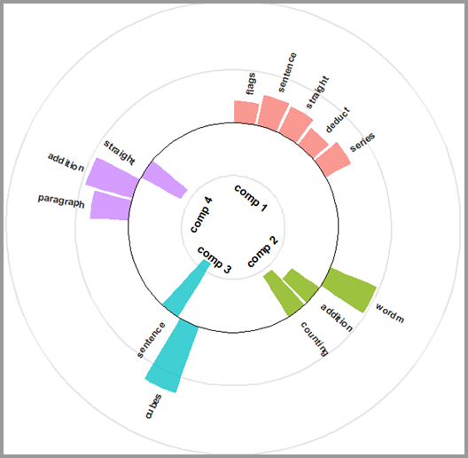

```{r, include = FALSE}
knitr::opts_chunk$set(
  cache = TRUE,
  collapse = TRUE,
  comment = "#>",
  fig.path = "figures/intro-"
)
#  ,out.width = "60%"
```
<!--  -->

<div style="display:flex; align-items:center; gap:15px;">

<h2>Package spca</h2>
</div>  

This package contains functions to compute, print and plot Least Squares Sparse Principal Components Analysis (LS-SPCA). Methodological details, references and full presentation can be found in the extended_vignette document.

## Installation
You can install the release version from CRAN

``` {r inst_cran,  eval = FALSE}
install.packages("spca")
```
or the development version from GitHub

``` {r inst_gib, , eval = FALSE}
remotes::install_github("merolagio/spca")
```
## Usage
The  main function *spca()* computes the sparse loadings and various statistics, such as the variance explained by each sparse component (sPC). print, summery and plot methods are available. PCA solutions stored as an `*spca*` object cn be obtained with the function  *pca()*.

Utilities available are *compare_spca()*` (to compare two or more spca solutions), *aggregate_by_scale()* (to visualize the contribution by scale) and *new.spca()* (to create an `spca` object from a set of loadings).

## Example

### Load data
The `holzinger` dataset is the small classic Holzinger-Swineford dataset with 145 cases on 12 variables grouped in 4 scales.
```{r load_data, echo = TRUE, cache = TRUE, message = FALSE, warning = FALSE}
library(spca)
data(holzinger)
dim(holzinger)
holzinger_scales
```

### Preliminary PCA
```{r pca_checks, cache = TRUE, message = FALSE, warning = FALSE, fig.show = "hold", out.width = "47%", fig.width = 4, fig.height = 4}
ho_pca = pca(holzinger, screeplot =  TRUE, qq_plot = TRUE)
summary(ho_pca,cols = 10)
```
We settle for 4 components

### Compute the sparse loadings
Important parameters in the *spca()* function are: *alpha* which controls for the minimum $R^2$ [default]) or the minimum proportion of cumulative variance explained (VEXP) by the sPCs realtive to that explained by the corresponding  PCs; *n_comps* the number of components to compute; *method* the LS-SPCA method to use ("u" for uncorrelated, "c" for correlated [default]) and "p" for projection; *var_selection* ("forward" [default], "stepwise", or "backward"). See the `**spca**` help for details on these parameters and more.

The following command computes four sPCs with default settings: *alpha = 0.95*, *var_selection = forward*, *method = "c"* that selects the *cSPCA* method. Hence, we expect each sPC to yield at least 0.95% cumulative VEXP, allowing some very mild correlation between sPCs.
```{r run_spca, cache = TRUE, message = FALSE, warning = FALSE}
myspca = spca(holzinger, n_comps = 4)
```

### Inspect spca results
Methods are *print*, *plot* (several options available) and *summary*.
By defaut, plot and print show the percentage *contributions*, that is the loadings scaled to have sum of their absolute values equal to 1.
```{r methods, cache = TRUE, message = TRUE, warning = FALSE, out.width="50%"}
myspca # print

summary(myspca, cor_with_pc = TRUE)

plot(myspca, plot_type = "bar")

#sPCs correlation
round(myspca$spc_cor, 2)

```

Other plot types are available.

Circular: 
```{r circular, cache = TRUE, message = FALSE, warning = FALSE, fig.width = 5, fig.height = 3}
plot(myspca, plot_type = "c") # "c" for "circular"
```

Heatmap:
```{r heatmap, cache = TRUE, message = FALSE, warning = FALSE, fig.width = 5, fig.height = 3}
plot(myspca, plot_type = "h", controls = list(legend_position = "b")) # "h" is enough to call "heatmap" type and "b" to indicate "bottom".
```

## Variable groups
The variables in the `holzinger` dataset belong to four different scales, recorded in the factor `holzinger_scales`. These can be differenciated in the barplot
```{r groups, cache = TRUE, message = FALSE, warning = FALSE, fig.width = 5, fig.height = 3}
plot(myspca, plot_type = "bars", variable_groups = holzinger_scales, controls = list(legend_position = "right")) 

aggregate_by_group(myspca,groups = holzinger_scales)
```

## Comparison of two or more spca solutions
Compare the *CSPCA* solutions with *alpha = 0.95* those with  *alpha = 0.90*.
```{r spca90, cache = TRUE, message = FALSE, warning = FALSE}
myspca90 = spca(holzinger, n_comps = 4, alpha = 0.9)

compare_spca(obj_list = list(myspca, myspca90), 
             methods_names = c("alpha = 95", "alpha = 90"))
```